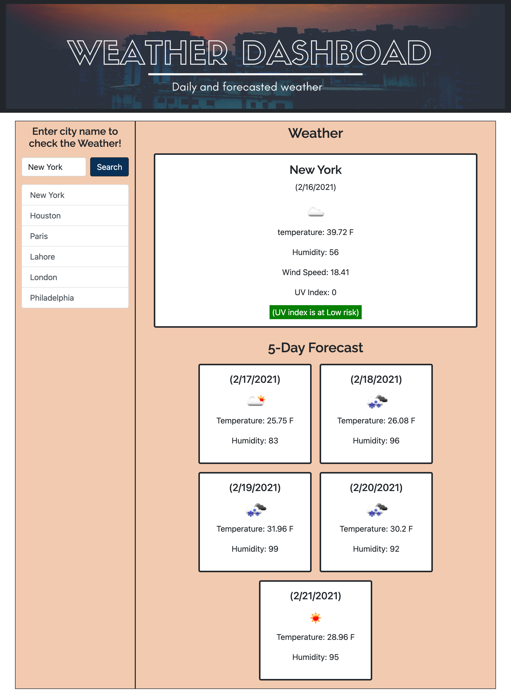

# Weather Dashboard

A weather app for looking up the current and forecasted weather for a given city.

This project called for the creation of a weather app using the Openweather API (https://openweathermap.org/api). The app functionality includes searching for and displaying the current weather as well as a 5-day forecast for any city that the user inputs. 

When the webpage loads, the user is presented with a simple UI with an input field for entering the name of the city for which weather data is needed. If nothing is entered in the input field, an error message is displayed and the user is asked to try again. If an incorrect city name is entered, again an error message is displayed. When a valid city name is entered, then the user is presented with the current weather conditions for the city, including temperature, humidity, wind speed, an icon representation of the weather and the UV Index. Beneath the UV Index is also information on whether the UV conditions are favorable, moderate or severe. 

Below the current weather conditions, the 5-day forecast for the city is also displayed within a card group. This forecast information includes the date, a weather icon, the temperature and the humidity.

When a city is searched for, it is added to the search history and this search history is displayed below the city input field. A max of 6 items are displayed for the search history.

If a city name in the displayed search history is clicked, then the current and forecasted weather conditions are displayed for that city again. 

Attached are images of the weather dashboard UI:

Attached is a link to the GitHib repository for the project:
https://github.com/nidaqg/weather-dashboard 

Attached is a link to the deployed application:
https://nidaqg.github.io/weather-dashboard/
